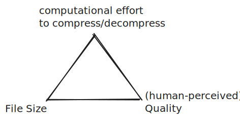

# BatchVideoCompression

The code in this repository is aimed at researchers at the University of Auckland (UoA) to compress video files on their existing storage infrastructure.
The code is tailored to the specific UoA research drive environment. 
Parts are inherited from [vault recall]([url](https://github.com/UoA-eResearch/vault_recall)https://github.com/UoA-eResearch/vault_recall) which makes sure that all videos on a given research drive are available for video compression (and not in ObjectStore/'Vault' subfolder or on magnetic tape/'Archive' subfolder.

## The benefits of compressed video

- fast viewing (especially if wanting to open the video on your local computer, or even an Virtual Machine (VM)). If you currently face challenges with stuttering video, compression might be a good solution
- video files maintain their location (stay in their folders), and file names are unchanged. Only the file extension (.mov, .mp4,...) might change
- original vidoe files are moved to the Archive/magnetic tape, so another backup exists
- less storage means more resources available to other researchers and less carbon footprint

## The drawback of compressing video are
- setup time and file handling (as a solution, we have created these programs/scrips/automations)
- compression time (highly CPU intense, therefore, we either provide you with a suitable VM or temporarily upgrade your existing VM)

## The prerequistes are

- get in touch with the Centre for eResearch to get an efficient overivew of how much storage space your videos on a given research drive take up
- get a sample of compressed video to gauge if these files are suitable
- a formal decision by the project's Principal Investigator (PI) station that the video compression is adequate for a given research project
- nominate a researcher/reserach supporter who supports the exection of this code

# In general: Video Compression

- This is a topic that frequently appears in different research contexts.
- For many (!) use-cases videos can be compressed to a fraction of their initial size without human-perceived quality degradation. Often, the compressed video gives a better user experience (it can be downloaded quicker, it might be streamed, whereas the less compressed video keeps stuttering, etc.)
- There is a constraint triangle (and some exceptions)

## Some theoretic examples
### Compressing a photo (one still frame)
- consider a 4K photo (3840 px * 2160 px). If we store 8bit of colour information per channel
	- Uncompressed = 23.73 MB
	- JPEG (depending on how well a given picture compresses; at "50% quality setting") ≅ 1.5MB
	- HEIC (iOS and others): 0.45MB

### Compressing a video
- Videos are a sequence of still images played at such a speed that the human brain is tricked into believing that a (fluid) motion is shown; typically 25 pictures per second (also known as 25 frames per second/fps).
- This has two main consequences:
	- Significantly **more data to store** (25x one photo as compressed above per second); in the uncompressed example, that would be 2.04TB per hour; that would be about 82 BluRay disks (which were known for their large size) and 1h isn't even a full feature film
	- At the same time, in many cases, there are only **very few changes from one still image to the next**. Compression algorithms mostly focus on that (based on already/differently compressed still images): Only recording what area changed. 
	- Dealing with fully uncompressed video almost never happens. Often, less storage-efficient codecs (for example, mjpeg) are used. 
- Typically, **compressing** a video takes a **significant** amount of time, whereas **playback** (mostly) **happens quickly** at the desired speed (25fps)

### Details on compression/the outliers
- some algorithms allow a 2 pass; to over-summarise: In pass 1: It is tested how well the specific bit of the video can be compressed. This is recorded. Instead of compressing every frame equally, the ones that require more storage space (say, fast motion of jump from one scene to another)
- there are two common codecs: h264 and h265
	- while h265 delivers better quality at the same file size
	- the compute needed to compress is significantly higher
- GPU (Graphical Processing Units) can, at times speed up the process, but the codec (compression-decompression) has to support that
- generally speaking, The compression can be parallelised a lot on the CPU! 128+ CPU? Great!
- there are dedicated devices for compression (for example, manufactured by [BlackMagic](https://www.blackmagicdesign.com/nz/products/ultrastudio/techspecs/W-DLUS-12)) These are able to get a live camera stream (often 25fps) and save a video compressed in h264 in real-time. This implies that a very powerful computer CPU can't output a given video in real-time; this tiny device can. How? Think of this analogy: A master sculptor creating a bust for each client (that takes hours), a layman putting a piece of clay into a mould and outputting one standard bust every second

## Implications for actual Researcher-Needs
- in the process of **planning** how to capture video, make sure that compression (codecs) is considered
- **investing** less than $300 might be a lot cheaper than running a powerful computer for weeks
- trim the relevant bits of your video 
	- basic functionality but no re-encoding (no sitting through potentially hours of coding)
		- [Lossless Cut](https://github.com/mifi/lossless-cut) (open source and free if downloaded directly/not via the App Stores)
		- ... many other solutions
		- Adobe Premiere Pro (which you might have a license for already as part of the Adobe Creative Cloud/currently for all staff )
- if **only a few videos** need to be compressed
	- for example, being out in the field with a slow internet connection and wanting to have a lower-quality backup
	- use the graphical interface of [HandBrake](https://handbrake.fr/) 
		- start with keeping video dimensions (i.e. number of pixels) the same as the input
		- reduce audio quality to 96kbit/s (unless high-quality audio trumps everything else)
		- pick h264 (1 pass for speed, 2pass for efficiency, always `turbo` if 2-pass) for speed of h265 for extra quality
		- make use of the preview functionality (to get an understanding of how the output image would look)
		- run this on one video file
			- if the file size is still too large, but the quality seems terrible, try reducing the number of pixels (dimensions)
- if many videos have to be compressed, this should be done programmatically
	- details in this GitHub repository
